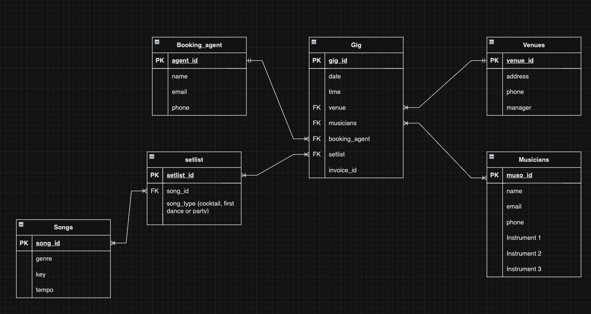

# Reece Doyle T2A2 -  Wedding Band API

## Github

- [Github](https://github.com/reecewdoyle/ReeceDoyle_T2A2)
- [Trello](https://trello.com/b/FZZtElT5/t2a2-flask-api)

## How to run the the Wedding API on your local machine. 


1. Create a new PostgreSQL database (I called mine `wed_db`)

2. Create a user and either grant all persmissions on `web_db`. This also works if you create a superuser. (I called my user `band_ldr`, as the intended user is a Band Leader)
3. Open from `cd ReeceDoyle_T2A2/src` or `cd src` if you're already in the ReeceDoyle_T2A2 folder. `code .`
4. Edit the `.env.example` file so `DATABASE_URI` matches user and database details, and enter a `JWT_SECRET_KEY` (mine was just "secret").
5. Edit the `flaskend.example` file to 
6. Create and activate virtual invironment `python3 -m venv venv && source venv/bin/activate`
7. Install requirements `pip3 install -r requirements.txt`
8. Create and seed tables `flask db drop && flask db create && flask db seed`
9. Run flask app `flask run`

***


## R1 - Identification of the problem you are trying to solve by building this particular app.
Weddings have always been a significant milestone in most cultures around the world. They're a time to celebrate the love of the couple that has made the commitment to each other in the precesence of their families and loved ones, **and what is a celebration without music?**

Whether it be during the ceremeony, during the cocktail hour, the first dance, or the party that ensues once the rituals are out of the way, every part of a wedding is filled with music. Thus, the orgainsation of the wedding musicians can truely make or break the day.

One of the problems a band leader will encounter is that (with very few exceptions, and at nearly every level of the industry) musicians are freelancers. Permanent, salaried positions are nonexistent. Even if you play in Taylor Swift or Paul McCartney band, at best you could be looking at a contract that lasts as long as a single tour. 

Musicians are several tiny, sole-trader entities that work together. Therefore, there is almost never a centralised organisation or staff to deligate tasks or handle the admin side of a wedding booking. This can create a myriad of issues with double-bookings, missed bookings, and particularly in the wedding industry, the wrong music being played for the event.
***

## R2 - Why is it a problem that needs solving?
The Wedding Industry is a highly competative environment where anything short of perfrection is not tolerated. 

**One bad experience from a client accompanied with a bad review on Google can absolutely sink a wedding vendor, leaving them with the expensive choice to either start from scratch with a rebrand, or get a day job!**

The saying amongst musicians is that **"You're only as good as your last gig"**, and that could not be more true than at a wedding. 

**The key to building a lucrative career as a Wedding/Functions musician is prepartion and organisation.**

The Wedding Band API is designed to give a Band Leader fast asscess to all the information they need to compile in the organisation and execution of a Wedding Booking. It allows the user to store a database of musicians and their instruments, contact details for booking agents, venue details, store the invoice number, specifiy the first dance song and aisle song for the wedding.  You can also specify a band leader through the musician field. 

This saves the musician from digging through a crowded email inbox and looking through badly routed foulders on a computer. 

**All the crucial data that you need to plan and execute a wedding gig in one spot!**
***

## R3 - Why have you chosen this database system. What are the drawbacks compared to others?
PostgreSQL is the Relationsal Database Management System used for this project. Apart from the fact that it's the only RDBMS that I've ever used, and the one that we've learned on this term, if think there is a good chance that down the track PortgreSQL might still be my choice for an app like this. 

For starters, it's a free, open source application with a large community of users who have itterated over it for 30 years. This means there is a very wide knowledge base to draw on for troubleshooting. If you come across a problem, it is very likely that someone else has already figured out the solution, or the problem may have been solved with a feature many generations ago. 

It's object related, which means it is able to handle classes, objects and inheritance rather than just strings and integers. This means an increase in functionality for the end user. It can support more complex data types like video, audio and images. 

PostgreSQL also allows a developer to write code in their preferred language (including but not limited to Python, Java, JavaScript, C, C++) to control PostgreSQL, which is significant for efficiency and automation. 

The ability to create seperate user accounts and grant access as is appropriate for individual users helps to protects the integrity of the data and reduces downtime caused by troubleshooting human error.

As great as it is, PostgreSQL still has it's downsides. There is a significant learning curve for beginners. For some, there might be too many options. There is a reliance on a lot of 3rd party libraires, which can be a blessing and a curse. At worst, that means that a lot of individuals are responsible for making sure that their library continues to work with PostgreSQL, rather than having inbuilt features that are kept in close tolerance by a centralised organisiation. There's also no warranty, which could be an issue for some, as it probably lacks a bit of the brand recognition and trust assiciated with a large company.

Another option would've been MongoDB. Being a NoSQL database means that it uses document oriented data modeling, meaning that you're not locked into a schema within a database. It allows for considerably more flexibility and stores data as documents in JSON or BSOn format.

A large part of what we've done in this assignment invloved serialising and deserialising the database to and from JSON via Marshmallow. MongoDB using a JSON like representation for data would cut down on the serialisation and deserialisation we have to do, meaining which could save some time. 

If we were to deploy our app and scale it up, there are many advantages to MongoDB as well. It allowes for Horizontal Scalaing, which means spreading the load of the data across multiple servers, rather than just getting a bigger server. It also allows for sharding, which spreads the data across multiple nodes for imporved performance and security. 

It also allows for Replication that allows for multiple replicas of the same dataset. We might want this to improve the security and performance. Multiple copies of the data that are kept in sync with each other allow minimise downtime when faults occur. It would also allwo for data to be concentrated around geographical locations where it is accessed the most to improve speed. 

 

## R4 - Identify and discuss the key functionalities and benefits of an ORM

Object-Relational Mapping is the method that allows object-oriented programming languages like Python to speak to relational databases without having to learn SQL. This significantly improves productivity as the developers are able to focus on using the language they know, rather than being hampered by having to learn a new one. 

It also means that a company is not tied to a single relational database. If a company were scale up from something like PostgreSQL to MongoDB, as long as the developers had a good handle on how to use SQLAlchemy's CRUD operations, downtime can be minimised. 
## R5 - Document all endpoints for your API

I've included an endpoints.json file to make importing my endpoints into insomnia quick and easy.

## Users

### `POST /auth/register`
 - Registers a new user with the wedding API. 

- Request Body: 
```json
{
	"name": "User10",
	"email": "user10@weddingband.com",
	"password": "123456"
}
```
- Response: 
```json
{
	"email": "user10@weddingband.com",
	"is_admin": false,
	"name": "User10",
	"id": 5,
}
```
***
### `POST /auth/login`
 - Logs a valid user in and returns a JWT token. 

- Request Body: 
```json
{
    "email": "user10@weddingband.com",
	"password": "123456"
}
```
- Response: 
```json
{
    "email": "user10@weddingband.com",
	"token": "eyJhbGciOiJIUzI (JWT shortened for brevity)",
	"is_admin": false
}
```
## Booking Agents
### `GET /agent`
 - Gets the list of booking agents currently stored in psql. 

- Response: 
```json
	{
		"id": 1,
		"title": "Miller Gold Talent Agency",
		"name": "Ari Gold",
		"email": "ari.gold@mga.com",
		"phone": "0412345678",
		"user": {
			"email": "admin@weddingband.com",
			"name": "Admin"
		}
	},
	{
		"id": 2,
		"title": "Michael Chugg Entertainment",
		"name": "Michael Chugg",
		"email": "chuggy@mce.com.au",
		"phone": "0487654321",
		"user": {
			"email": "admin@weddingband.com",
			"name": "Admin"
		}
	}
```
***
### `POST /agent`
 - Posts a new booking agent to psql. 
- JWT required
- Request: 
```json
{
	"title": "Polymer Entertainment",
	"name": "Artie Fufkin",
	"email": "arthurf@polymer.com",
	"phone": "0412457888"
}
```
- Response: 
```json
{
	"id": 3,
	"title": "Polymer Entertainment",
	"name": "Artie Fufkin",
	"email": "arthurf@polymer.com",
	"phone": "0412457888",
	"user": {
		"name": "Admin",
		"email": "admin@weddingband.com"
	}
}
```
***
### `PATCH /agent/<int:agent_id>`
 - Updates an existing booking agent in psql. 
- JWT required
- Request: 
```json
{
	"name": "Arthur James Fufkin"
}
```
- Response: 
```json
{
	"id": 3,
	"title": "Polymer Entertainment",
	"name": "Arthur James Fufkin",
	"email": "arthurf@polymer.com",
	"phone": "0412457888",
	"user": {
		"name": "Admin",
		"email": "admin@weddingband.com"
	}
}
```
***
### `DELETE /agent/<int:agent_id>`
 - Deletes an existing booking agent from psql. 
- JWT required
- Response: 
```json
{
	"message": "Agent Arthur James Fufkin deleted successfully"
}
```
***
## Aisle Songs
### `GET /aisle`
 - Gets the list of aisle songs currently stored in psql. 

- Response (shortened for brevity): 
```json
	{
		"id": 1,
		"title": "Pachelbel's Canon",
		"artist": "Johann Pachelbel",
		"genre": "Classical",
		"key": "D",
		"tempo": 62,
		"user": {
			"email": "admin@weddingband.com",
			"name": "Admin"
		}
	},
	{
		"id": 2,
		"title": "A Thousand Years",
		"artist": "Christina Perri",
		"genre": "Pop",
		"key": "Bb",
		"tempo": 95,
		"user": {
			"email": "admin@weddingband.com",
			"name": "Admin"
		}
	},
```
***
### `POST /aisle`
 - Posts a new aisle song to psql. 
- JWT required
- Request: 
```json
{
  "title": "Hallelujah",
  "artist": "Leonard Cohen",
  "genre": "Folk",
  "key": "C",
  "tempo": 65
}
```
- Response: 
```json
{
	"id": 6,
	"title": "Hallelujah",
	"artist": "Leonard Cohen",
	"genre": "Folk",
	"key": "C",
	"tempo": 65,
	"user": {
		"name": "Admin",
		"email": "admin@weddingband.com"
	}
}
```
***
### `PATCH /aisle/<int:aisle_song_id>`
 - Updates an existing aisle song in psql. 
- JWT required
- Request: 
```json
{
	"key": "D"
}
```
- Response: 
```json
{
	"id": 6,
	"title": "Hallelujah",
	"artist": "Leonard Cohen",
	"genre": "Folk",
	"key": "D",
	"tempo": 65,
	"user": {
		"name": "Admin",
		"email": "admin@weddingband.com"
	}
}
```
***
### `DELETE /aisle/<int:aisle_song_id>`
 - Deletes an existing aisle song from psql. 
- JWT required
- Response: 
```json
{
	"message": "Aisle Song with Hallelujah deleted successfully"
}
```
***
## First Dance Songs
### `GET /firstdance`
 - Gets the list of first dance songs currently stored in psql. 

- Response (shortened for brevity): 
```json
	{
		"id": 1,
		"title": "At Last",
		"artist": "Etta James",
		"genre": "Soul",
		"key": "F",
		"tempo": 65,
		"user": {
			"name": "Admin",
			"email": "admin@weddingband.com"
		}
	},
	{
		"id": 2,
		"title": "Thinking Out Loud",
		"artist": "Ed Sheeran",
		"genre": "Pop",
		"key": "D",
		"tempo": 79,
		"user": {
			"name": "Admin",
			"email": "admin@weddingband.com"
		}
	},
```
***
### `POST /firstdance`
 - Posts a new first dance song to psql. 
- JWT required
- Request: 
```json
{
  "title": "Perfect",
  "artist": "Ed Sheeran",
  "genre": "Pop",
  "key": "A",
  "tempo": 95
}
```
- Response: 
```json
{
	"id": 6,
	"title": "Perfect",
	"artist": "Ed Sheeran",
	"genre": "Pop",
	"key": "A",
	"tempo": 95,
	"user": {
		"name": "Admin",
		"email": "admin@weddingband.com"
	}
}
```
***
### `PATCH /firstdance/<int:first_dance_song_id>`
 - Updates an existing first dance song in psql. 
- JWT required
- Request: 
```json
{
	"key": "B"
}
```
- Response: 
```json
{
	"id": 6,
	"title": "Perfect",
	"artist": "Ed Sheeran",
	"genre": "Pop",
	"key": "B",
	"tempo": 95,
	"user": {
		"name": "Admin",
		"email": "admin@weddingband.com"
	}
}
```
***
### `DELETE /firstdance/<int:first_dance_song_id>`
 - Deletes an existing first dance song from psql. 
- JWT required
- Response: 
```json
{
	"message": "First Dance Song with Perfect deleted successfully"
}
```
****************************************************************
## Gigs
### `GET /gigs`
 - Gets the list of gigs currently stored in psql. 

- Response (shortened for brevity): 
```json
	{
		"id": 1,
		"date": "2024-01-04",
		"time": "17:00:00",
		"invoice": "1001",
		"venue": {
			"title": "VALHALLA RESTAURANT BAR",
			"address": "3834 Nelson Bay Road,Bobs Farm, NSW 2316"
		},
		"agent": {
			"name": "Ari Gold",
			"phone": "0412345678",
			"email": "ari.gold@mga.com"
		},
		"user": {
			"email": "admin@weddingband.com",
			"name": "Admin"
		},
		"musician": {
			"name": "Grant Green",
			"instrument": "Guitar"
		},
		"aisle_song": {
			"title": "Pachelbel's Canon",
			"key": "D",
			"tempo": 62
		},
		"first_dance_song": {
			"title": "At Last",
			"key": "F",
			"tempo": 65
		}
	},
```
### `POST /gigs`
 - Posts a new gig to psql. 
- JWT required
- Request: 
```json
{
	"date": "03/04/2024",
	"time": "16:30:00",
	"invoice": "1005",
	"venue_id": "1",
	"agent_id": "2",
	"musician_id": "3",
	"aisle_song_id": "4",
	"first_dance_song_id": "3" 
}
```
- Response:
```json
{
	"id": 3,
	"date": "2024-03-04",
	"time": "16:30:00",
	"invoice": "1005",
	"venue_id": 1,
	"agent_id": 2,
	"user_id": 1,
	"musician_id": 3,
	"aisle_song_id": 4,
	"first_dance_song_id": 3
}
```
***
### `PATCH /gig/<int:gig_id>`
 - Updates an existing gig in psql. 
- JWT required
- Request: 
```json
{
	"date": "10/10/2024",
	"time": "15:30:00"
}
```
- Response: 
```json
{
	"id": 1,
	"date": "2024-10-10",
	"time": "15:30:00",
	"invoice": "1001",
	"venue": {
		"title": "VALHALLA RESTAURANT BAR",
		"address": "3834 Nelson Bay Road,Bobs Farm, NSW 2316"
	},
	"agent": {
		"name": "Ari Gold",
		"phone": "0412345678",
		"email": "ari.gold@mga.com"
	},
	"user": {
		"name": "Admin",
		"email": "admin@weddingband.com"
	},
	"musician": {
		"name": "Grant Green",
		"instrument": "Guitar"
	},
	"aisle_song": {
		"title": "Pachelbel's Canon",
		"key": "D",
		"tempo": 62
	},
	"first_dance_song": {
		"title": "At Last",
		"key": "F",
		"tempo": 65
	}
}
```
***
### `DELETE /gig/<int:gig_id>`
 - Deletes an existing gig from psql. 
- JWT required
- Response: 
```json
{
	"message": "Gig on 2024-10-10 deleted successfully"
}
```
****************************************************************
## Musicians
### `GET /musician`
 - Gets the list of musicians currently stored in psql. 

- Response (shortened for brevity): 
```json
	{
		"id": 1,
		"name": "Grant Green",
		"instrument": "Guitar",
		"email": "info@grantgreen.net",
		"phone": "0455566899",
		"user": {
			"name": "Admin",
			"email": "admin@weddingband.com"
		}
	},
	{
		"id": 2,
		"name": "Wes Montgomery",
		"instrument": "Guitar",
		"email": "info@wes.net",
		"phone": "0455566888",
		"user": {
			"name": "Admin",
			"email": "admin@weddingband.com"
		}
	},
	{
		"id": 3,
		"name": "Guthrie Goven",
		"instrument": "Guitar",
		"email": "guthrie@guthriegoeven.com",
		"phone": "0455566887",
		"user": {
			"name": "Admin",
			"email": "admin@weddingband.com"
		}
	},
	{
		"id": 4,
		"name": "Jaco Pastorius",
		"instrument": "Bass",
		"email": "j@jaco.com",
		"phone": "0444587189",
		"user": {
			"name": "Admin",
			"email": "admin@weddingband.com"
		}
	},
```
### `POST /musician`
 - Posts a new musician to psql. 
- JWT required
- Request: 
```json
{
	"name": "Mark Knopfler",
	"email": "mark@moneyfornothing.com",
	"phone": "0401234567",
	"instrument": "Guitar"
}
```
- Response:
```json
{
	"id": 18,
	"name": "Mark Knopfler",
	"instrument": "Guitar",
	"email": "mark@moneyfornothing.com",
	"phone": "0401234567",
	"user": {
		"email": "admin@weddingband.com",
		"name": "Admin"
	}
}
```
***
### `PATCH /musician/<int:musician_id>`
 - Updates an existing musician in psql. 
- JWT required
- Request: 
```json
{
	"email": "mark@direstraights.com"
}
```
- Response: 
```json
{
	"id": 18,
	"name": "Mark Knopfler",
	"instrument": "Guitar",
	"email": "mark@direstraights.com",
	"phone": "0401234567",
	"user": {
		"email": "admin@weddingband.com",
		"name": "Admin"
	}
}
```
***
### `DELETE /musician/<int:musician_id>`
 - Deletes an existing musician from psql. 
- JWT required
- Response: 
```json
{
	"message": "Musician Mark Knopfler deleted successfully"
}
```
****************************************************************
## Venues
### `GET /venues`
 - Gets the list of venues currently stored in psql. 

- Response (shortened for brevity): 
```json
	{
		"id": 1,
		"title": "VALHALLA RESTAURANT BAR",
		"manager": "Trevor Odinson",
		"address": "3834 Nelson Bay Road,Bobs Farm, NSW 2316",
		"phone": "0454234556",
		"user": {
			"email": "admin@weddingband.com",
			"name": "Admin"
		}
	},
	{
		"id": 2,
		"title": "Lovedale Wedding Chapel and Reception",
		"manager": "Cyril Lovedale",
		"address": "842 Lovedale Road, Allandale, NSW 2320",
		"phone": "0412457889",
		"user": {
			"email": "admin@weddingband.com",
			"name": "Admin"
		}
	},
	{
		"id": 3,
		"title": "Fort Scratchley Function Centre",
		"manager": "Cletus Scratchley",
		"address": "1/3 Nobbys Road, Newcastle East, NSW 2300",
		"phone": "0415234556",
		"user": {
			"email": "admin@weddingband.com",
			"name": "Admin"
		}
	}
```
### `POST /venues`
 - Posts a new venue to psql. 
- JWT required
- Request: 
```json
{
	"title": "Ravalla",
	"manager": "Jerome O'Connor",
	"address": "48 Watt St, Newcastle NSW 2300",
	"phone": "0415121316"
}
```
- Response:
```json
{
	"id": 4,
	"title": "Ravalla",
	"manager": "Jerome Connors",
	"address": "48 Watt St, Newcastle NSW 2300",
	"phone": "0415121316",
	"user": {
		"name": "Admin",
		"email": "admin@weddingband.com"
	}
}
```
***
### `PATCH /venues/<int:venue_id>`
 - Updates an existing venue in psql. 
- JWT required
- Request: 
```json
{
	"phone": "0404050607"
}
```
- Response: 
```json
{
	"id": 4,
	"title": "Ravalla",
	"manager": "Jerome Connors",
	"address": "48 Watt St, Newcastle NSW 2300",
	"phone": "0404050607",
	"user": {
		"email": "admin@weddingband.com",
		"name": "Admin"
	}
}
```
***
### `DELETE /venues/<int:venue_id>`
 - Deletes an existing venue from psql. 
- JWT required
- Response: 
```json
{
	"message": "Venue Ravalla deleted successfully"
}
```
## Error Handling and Validations:
Here are some examples of the error handling code within the main.py file. 
```python
    @app.errorhandler(400)
    def bad_request(err):
        return {"error": str(err)}, 400
    
    @app.errorhandler(404)
    def not_found(err):
        return {"error": str(err)}, 404

    @app.errorhandler(ValidationError)
    def validation_error(error):
        return {"error": error.messages}, 400
```
This will catch most 400 level errors and return the appropriate error message. 

```python
def authorise_as_admin(fn):
    @functools.wraps(fn)
    def wrapper(*args, **kwargs):
        user_id = get_jwt_identity()
        stmt = db.select(User).filter_by(id=user_id)
        user = db.session.scalar(stmt)
        # if the user is an admin
        if user.is_admin:
            # we will continue and run the decorated function
            return fn(*args, **kwargs)
        # else (if the user is NOT an admin)
        else:
            # return an error 
            return {"error": "Not authorised to delete an agent"}, 403
```
This decorated function will determine if the user is an admin or not. 

It simply requires adding the decorator within a function:
```python
@authorise_as_admin
```
An alternative function that I've used in most of the controllers is this:

```python
def is_user_admin():
    user_id = get_jwt_identity()
    stmt = db.select(User).filter_by(id=user_id)
    user = db.session.scalar(stmt)
    return user.is_admin
```
This works in conjunction with this decorator:
```python
@jwt_required
```
These lines of code get the `jwt_identity` of the user to determine the owner of the data created. This way, only the owner can update the data. 
```python
    if venue:
        if str(venue.user_id) != get_jwt_identity():
            return {"error": "Only the owner can edit the venue data"}, 403
```
Both of the last two functions do the same thing, and I could use one or the other. I'd already made the later function I mentioned before I learned how to make the `@authorise_as_admin` decorator, so I left it in there the focus on other tasks. 

As for some validations, i used `Length`, `And`, and `Regexp` from `Marshmallow`. Here's an example of how I implemented it within the `AgentSchema`.
```python
    title = fields.String(required= True, validate=And(
        Length(min=2, error="Title must be at least 2 characters long"),
        Regexp('^[a-zA-Z0-9 ]+$', error="Title can only have alphanumeric characters")
    ))
    name = fields.String(required= True, validate=And(
        Length(min=2, error="Name must be at least 2 characters long"),
        Regexp('^[a-zA-Z0-9 ]+$', error="Name can only have alphanumeric characters")
    ))

    email = fields.String(required= True, validate=And(
        Length(min=2, error="Title must be at least 2 characters long"),
        Regexp('^[a-zA-Z0-9_.+-]+@[a-zA-Z0-9-]+\.[a-zA-Z0-9-.]+$', error="Must enter a valid email address")
    ))

    phone = fields.String(required= True, validate=And(
        Length(min=10, error="Phone number must be at least 10 numbers long"),
        Regexp('^(?:\+?(61))? ?(?:\((?=.*\)))?(0?[2-57-8])\)? ?(\d\d(?:[- ](?=\d{3})|(?!\d\d[- ]?\d[- ]))\d\d[- ]?\d[- ]?\d{3})$', error="Must enter a valid phone number")
    ))

```
I also used some validations where there was only a limited number of acceptable answers. One example is in `genre` on the `aisle_song` and `first_dance_song` tables:

```python
VALID_GENRES = ("Rock", "Pop", "Folk", "Country", "Jazz", "Funk", "R&B", "Hip Hop", "Rap", "Metal", "Hard Rock", "Classical")

    genre = fields.String(validate=OneOf(VALID_GENRES))
```
This used the `OneOf` function to specify that the answer had to be one of the above approved genres of music that would be required to play at a wedding.

*Polka omitted for brevity....(and sanity).*


I had some considerable self imposed setbacks within my design and spending too much time trying to make them work (as you will see in the iterations of my ERD) which unfrotunately cost me, as I didn't allow myself enough time to get the assisstance I should have gotten much earlier in this 'sprint'. 

In the User and Gig schemas I would have validated exactly what was required for a user name (a minimum number of characters, and a regexp to make it alphanumeric only), I would implement the regexp for the email address that I used, and I would have better handled the issue I came across with using foreign keys as input data. Integer inputs could've been limited to an exceptable range,and unfortunately I also had an issue getting the Gig endpoints to serialise with the nested fields like I wanted to. It still works, but it's not pretty.  
## R6 - An ERD for your app
This is the ERD I settled on....eventually....oh how I wish this is where I started....

My first approved design has some issues:

There needed to be join tables bewteen songs and setlist tables, but also the musicians and gig table and neither are indicated on my ERD. 

My intial intention was to have a database of musicians that could be added to the gig table. Unfortunately I relaised that I'd actually only allowed for a single field. My understanding is that this would populate with only a single musician. That wasn't going to work, as I wanted it to be able to specify which combination of musicians would be performing. It's not uncommon for musicians to either have multiple bands that they work within. Some have no band at all and just "float" between gigs. To get around this I moved to a different itteration of my ERD


The introduction of the band table was intended to work as a place to create a band for the gig, and specify who was going to play what in the band, as many musicians are multi-instrumentalists. This was a many-to-many relationship that required a join table. I naively though I this was easy, but how wrong I was... I learned the hard way about why these are hard to use. I spent FAR too much time stubournly trying to make this work, and I didn't ask enough questions. I was letting my pride drive me at this point, and I though I could figure it out myself with online resources when I should really have just spent more time in the design phase and started with something much smaller and built outwards. 

To get around this, I attempted to have all the musicians specified in the gig table. I figured this would eliminate the need for the join table, but it caused issues with serilaising multiple foreign keys. I also had the issue of being able to put multiple instances of the same musician into a single gig, which is obviously not ideal:


I then realised far too late that I had made the same mistake with the setlist and songs list. I had originally intended to have a table for each of the functions music plays in a wedding; Cocktail Hour, First Dance and Party Hour.


I though this problem was solved by having the function turned into an attribute on the setlist table. This also didn't work as we're still talking a many-to-many relationship requiring a join table, which I AGAIN (I guess I'm a slow learner) spent far too long trying to make work. 

To design my way out of this, I boiled the songs required down to the most important songs of the evening: The First Dance, and the music played as one of the parties walks down the Aisle. Thus, I replaced the songs and setlists tables with the First Dance Song and Aisle Songs tables in the final app. 

The work around that I came up with far too late was that I could've sorted the musicians into tables depending on their instruments: Drums, Guitar, Vocals, Bass, Keys, etc. This would've allowed me to have multiple musicians on the table at once. Each gig generally only has one of each instrument. To make use of the musician table that I'd already created, I had a musician in the gig table, who would function more as bandleader. At the abolute least, defining the person in charge eliminates some squables and deligates responsibiliity. 

In retrospect, the songlist element of the app is probably enough to be it's own app. I think if I had my time again, I would just make the app a "setlist builder" and I would incorporate the Spotify API. Lesson learned......


## R7 - Detail any third party services that your app will use
Modules used. SQLALchemy etc.

I used multiple third party services with Python to create this application.

Multiple third party services will be used in the application.
| Service         | Description |
| --------------- | ----------- |
| Flask           | A microserver which allows the user to create web applications within Python. It contains tools for handling web requests and routing. It also works with other libraries within the app. |
| PostgreSQL      | The relational database management system. Open source and ACID compliant. Perfect for small applications like this. |
| SQLAlchemy      | Object-Relational Mapping (ORM) toolkit which allows Python objects to work as SQL queries |
| Marshmallow     | Enabling easy serialisation and deserialisation of complex data types|
| Bcrypt          | A password-hashing function |
| JSON Web Tokens | Used for user authentication and authorisation |
| Psycopg2        | Allows Python applications to connect to and interact with PostgreSQL |
| dotenv          | Loads environment variables from a .env file making it easier to configure settings and hide JWT secret key|

## R8 - Describe your projects models in terms of the relationships they have with each other
Each of the tables have a One to Many relationship with the Gig Table. 
A gig can have only one Agent, Aisle Song, First Dance Song, Musician (band leader), User who created the gig entry, and venue. However, each of these relationships can happen across many gigs......*or at least they should if your band is good at what they do!*


The relationships are specified in the models, which generall look like this:
```python
class Agent(db.Model):
    __tablename__ = 'agent'

    id = db.Column(db.Integer, primary_key=True)
    title = db.Column(db.String, nullable=False)
    name = db.Column(db.String, nullable=False)
    email = db.Column(db.String, nullable=False)
    phone = db.Column(db.String, nullable=False)

    user_id = db.Column(db.Integer, db.ForeignKey("users.id"), nullable=False)

    user = db.relationship("User", back_populates="agent")
    gigs = db.relationship("Gig", back_populates="agent")
```

## R9 - Discuss the database relations to be implemented in your application
This is a Flask Application, which uses PostgreSQL as it's as it's relational database. It is written in Python, and utilises the SQLAlchemy ORM to allow the user to write queries in Python rather than using Strucured Query Language (SQL). It's essentiall in a "hub and spokes" shape where everything flows back to the gig table. The app is accessed by using dotenv and psycopg2 to specify the `DATABASE_URI=` and `JWT_SECRET_KEY=`. and also the `.flaskenv`, which I used to specify that the app was in `main.py`, I wanted debugging on, and I wanted to be on Port 8080, as I'm a music obsessed Mac user, and Mac uses Port 5000 for AirPlay. I'm constantly streaming from my laptop as I code, so this eliminated that problem. 
```python
FLASK_APP=main
FLASK_DEBUG=1
FLASK_RUN_PORT=8080
```
I've also used Insomnia to view my CRUD requests and have exported the endpoints to an endpoints.json file for easy loading. 

## R10 - Describe the way tasks are allocated and tracked in your project

To track my progress I used both Trello and a checklist in Notion.


*In retrospect, I should've spent much more time in the "brainstorm" phase!*


